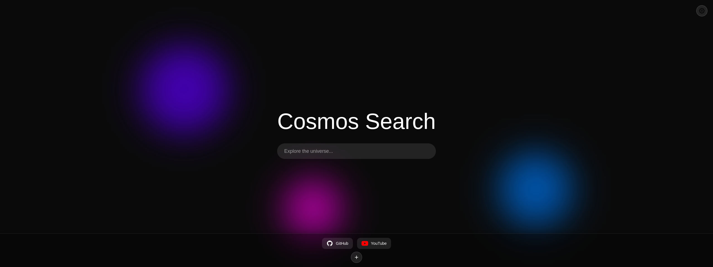

## 📸 Preview

Here are some images of Cosmos Search:

## 🔧 Technical Details

- **React Hooks** (no boring class components here).
- **LocalStorage** to save preferences without needing a server.
- **Modern CSS** (variables, backdrop-filter, responsive layout).
- **Dynamic SVG for icons** (because PNG is outdated).
- I tried to **polish the code**, but **I’m not a professional**—it’s still rough, but I did my best.
- There are orphaned parts because **it’s still in development**.

## ⚠️ Limitations

- **No cross-device sync**. Contributions are welcome. :D
- **Zero compatibility with old browsers.**
- **It might break.** I work on this when I have time.
- **Documentation?** Hahaha! If you need it, maybe you shouldn’t be messing with this.

## 🛠️ Future Plans

- More **themes and visual customization** without editing the code.
- Maybe a **browser extension version** (if I have the patience).
- Or maybe I’ll **abandon this and do something else**. That’s life.

## 🎯 Who is this for?

- People who **like exploring code and personal projects**.
- People who **understand this is not a commercial product**.
- People who **think default homepages are garbage**.
- People who **prefer modifying their tools instead of accepting ready-made solutions**.

